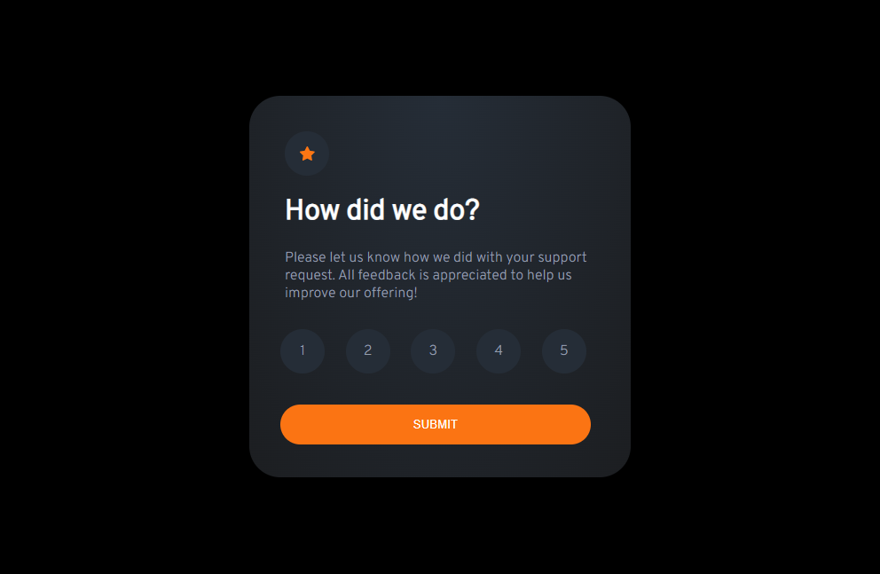
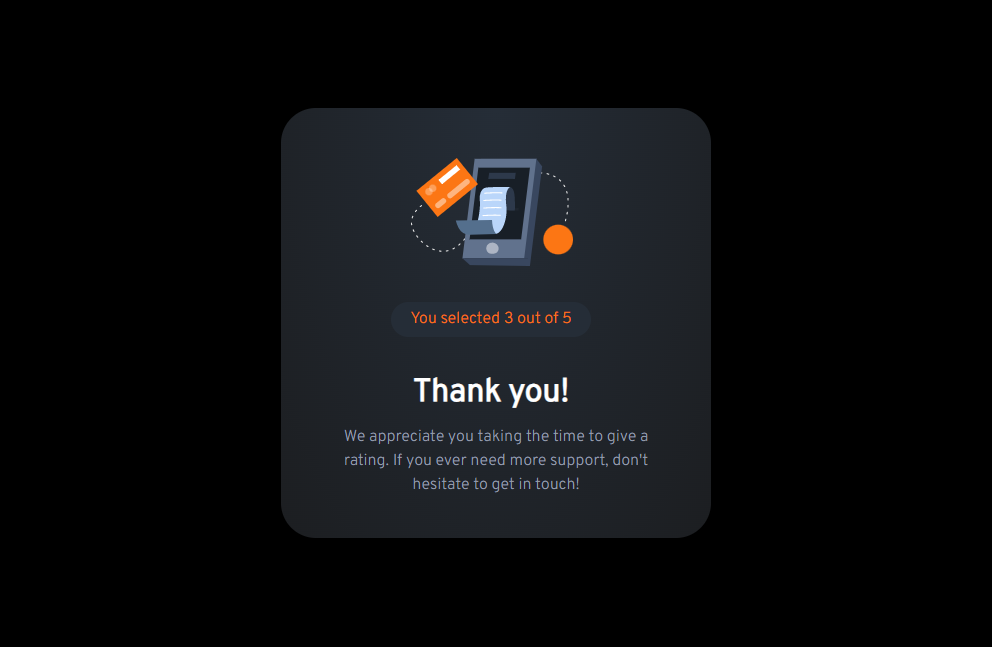

# Subbmiter go - Interactive rating component

Project from [Frontend Mentor](https://www.frontendmentor.io/challenges/interactive-rating-component-koxpeBUmI?fbclid=IwAR3jp9AhPXAj-rDWnzNmUY1LyZL7pfvvhnUA28TaRxZOQqFkHouQyZs0tF4).
It was made in technologies: HTML,CSS,JS.

This challenge is to build out interactive rating component and get it looking as close to the design as possible.

The application has an optimal layout depending on the screen size of the device

